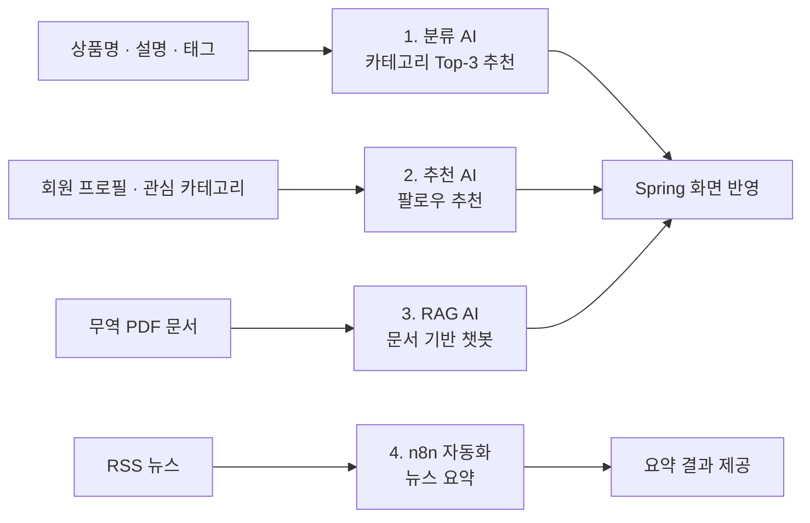
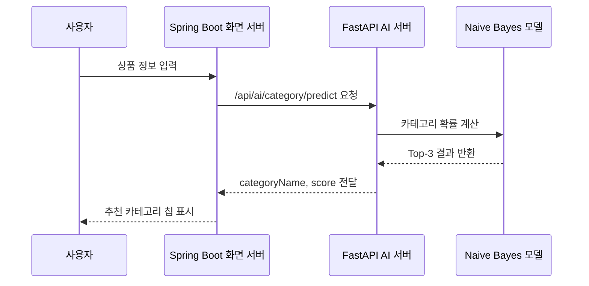
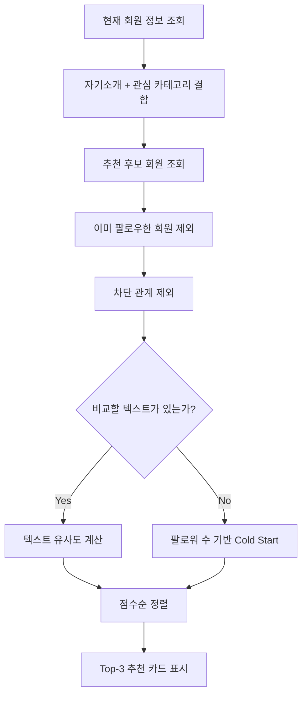
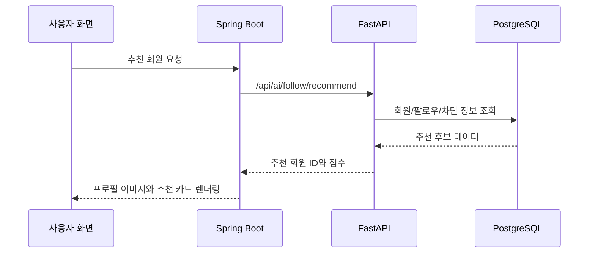
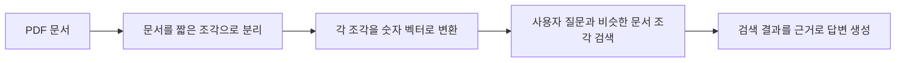
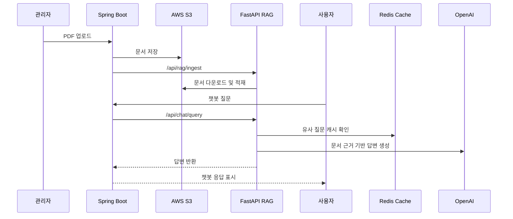
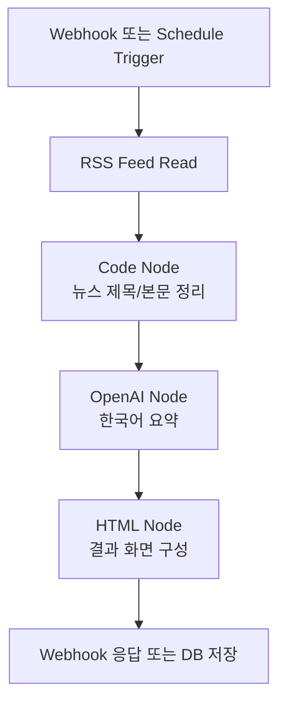
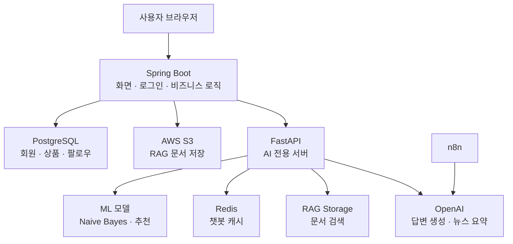

# GlobalGates AI 발표 자료

> **AI로 연결하는 글로벌 B2B 비즈니스 소셜 마켓**
>
> GlobalGates는 중소기업이 해외 바이어를 찾고, 상품을 올바른 카테고리에 노출하고,
> 복잡한 무역 문서를 이해하는 과정을 AI로 보조하는 서비스입니다.
>
> 발표 흐름은 **분류 → 추천 → RAG → n8n 자동화** 순서로 구성했습니다.


---

## 목차

1. [기획 배경 & 의도](#1-기획-배경--의도)
2. [데이터 수집 및 전처리](#2-데이터-수집-및-전처리)
3. [머신러닝 분류 - Naive Bayes](#3-머신러닝-분류---naive-bayes)
4. [추천 시스템 - 팔로우 추천](#4-추천-시스템---팔로우-추천)
5. [LLM RAG - 무역 문서 챗봇](#5-llm-rag---무역-문서-챗봇)
6. [n8n - 뉴스 요약 자동화](#6-n8n---뉴스-요약-자동화)
7. [서비스 연동 구조](#7-서비스-연동-구조)
8. [발표 핵심 정리](#8-발표-핵심-정리)

---

## 1. 기획 배경 & 의도

중소기업은 국내 기업 수의 대부분을 차지하지만, 실제 수출 교역액은 대기업에 크게 의존합니다.
GlobalGates는 이 격차를 줄이기 위해 **상품 등록, 거래 상대 탐색, 무역 정보 탐색, 뉴스 수집**에 AI를 적용했습니다.


| 문제 | AI 적용 | 사용자가 얻는 가치 |
|---|---|---|
| 상품을 어떤 카테고리에 올릴지 애매함 | Naive Bayes 카테고리 분류 | 상품 등록 시간 감소 |
| 거래 목적이 맞는 사람을 찾기 어려움 | 프로필 기반 팔로우 추천 | 바이어/셀러 연결 가능성 증가 |
| 무역 문서를 직접 읽기 어려움 | RAG 기반 문서 챗봇 | 통관/수출입 정보 탐색 비용 감소 |
| 해외 경제 뉴스를 계속 보기 어려움 | n8n RSS 자동 수집 및 요약 | 시장 이슈 자동 파악 |

### 전체 AI 흐름



---

## 2. 데이터 수집 및 전처리

AI 기능별로 필요한 데이터가 다르기 때문에, 외부 데이터와 서비스 내부 데이터를 나눠서 구성했습니다.

| 데이터 | 규모 | 사용 기능 |
|---|---:|---|
| 네이버 쇼핑 OpenAPI | 70,000건 | 상품 카테고리 분류 |
| 네이버 뉴스/블로그 OpenAPI | 112,000건 | 무역/상품 텍스트 보강 |
| 최종 학습 데이터 | 176,426건 | Naive Bayes 모델 학습 |
| CountVectorizer 어휘 수 | 396,276개 | 텍스트를 숫자 벡터로 변환 |
| 회원 데이터 | 508명 | 팔로우 추천 |
| 팔로우 관계 | 2,422건 | 이미 연결된 회원 제외 |
| 회원-카테고리 관계 | 1,605건 | 관심사 기반 추천 |
| RAG PDF 문서 | 11개 / 315페이지 | 무역 문서 챗봇 |

### 전처리 개념

개발을 모르는 사람이 이해하기 쉽게 말하면, 전처리는 **AI가 읽을 수 있도록 글자를 정리하는 과정**입니다.

| 원본 | 전처리 결과 | 사용처 |
|---|---|---|
| 상품명, 설명, 태그 | 하나의 상품 설명 문장 | 카테고리 분류 |
| 자기소개, 관심 카테고리 | 회원을 설명하는 문장 | 팔로우 추천 |
| PDF 문서 | 짧은 문단 조각 | RAG 검색 |
| RSS 뉴스 | 제목과 본문 요약 대상 | n8n 자동 요약 |

---

## 3. 머신러닝 분류 - Naive Bayes

> **목표**: 사용자가 상품명, 설명, 태그를 입력하면 가장 어울리는 카테고리 3개를 추천합니다.

### 왜 필요한가

상품 등록 화면에서 사용자가 카테고리를 직접 찾으면 시간이 오래 걸립니다.
GlobalGates는 입력된 상품 텍스트를 분석해서 **가장 가능성이 높은 카테고리 Top-3**를 보여줍니다.

### 모델 성능

| 모델 | Accuracy | Precision | Recall | F1 | AUC |
|---|---:|---:|---:|---:|---:|
| **CountVectorizer + MultinomialNB** | **0.9406** | 0.9429 | 0.9413 | **0.9408** | **0.9946** |
| CountVectorizer + DecisionTree | 0.9147 | 0.9176 | 0.9165 | 0.9150 | 0.9530 |

Naive Bayes는 Decision Tree보다 정확도와 AUC가 높았습니다. 특히 AUC가 **0.9946**으로 높아,
정답 하나만 고르는 방식보다 **확률이 높은 후보 3개를 보여주는 화면 UX**에 적합했습니다.


### 학습 코드 핵심

```python
m_nb_pipe = Pipeline([
    ("count_vectorizer", CountVectorizer()),
    ("naive_bayes", MultinomialNB()),
])

m_nb_pipe.fit(X_train.values, y_train)
prediction = m_nb_pipe.predict(X_test.values)
proba = m_nb_pipe.predict_proba(X_test.values)
```

**쉬운 설명**

| 코드 | 의미 |
|---|---|
| `CountVectorizer()` | 사람이 쓴 문장을 AI가 계산할 수 있는 숫자로 바꿈 |
| `MultinomialNB()` | 단어 출현 패턴을 보고 카테고리를 예측하는 모델 |
| `predict_proba()` | 카테고리별 가능성을 확률로 계산 |

### FastAPI 실제 코드

```python
@router.post("/category/predict", response_model=CategoryPredictResponse)
async def predict_category(request: CategoryPredictRequest):
    return await ai_service.predict_category(
        request.postTitle,
        request.postContent,
        request.postTag,
    )
```

```python
text = " ".join(value for value in [post_title, post_content, post_tag] if value)
probabilities = model.predict_proba([text])[0]

ranked_indices = sorted(
    range(len(probabilities)),
    key=lambda i: probabilities[i],
    reverse=True,
)[:3]
```

**쉬운 설명**

1. 사용자가 상품명, 설명, 태그를 입력합니다.
2. FastAPI가 세 문장을 하나로 합칩니다.
3. 모델이 카테고리별 확률을 계산합니다.
4. 확률이 높은 3개 카테고리만 화면에 돌려줍니다.

### 화면 적용 흐름



---

## 4. 추천 시스템 - 팔로우 추천

> **목표**: 회원의 자기소개와 관심 카테고리를 보고, 연결 가능성이 높은 회원을 추천합니다.

### 추천에 사용한 데이터

| 데이터 | 규모 | 역할 |
|---|---:|---|
| 회원 데이터 | 508명 | 추천 후보 |
| 팔로우 관계 | 2,422건 | 이미 팔로우한 회원 제외 |
| 회원-카테고리 관계 | 1,605건 | 관심사 비교 |
| TF-IDF 유사도 행렬 | 508 × 508 | 노트북 검증용 유사도 계산 |
| 화면 추천 개수 | Top-3 | 사용자에게 보여줄 추천 카드 |


### 추천 로직



### FastAPI 실제 코드

```python
me_text = self.build_text(me)

if me_text:
    rows = self.rank_with_tfidf(me_text, rows)
else:
    rows.sort(key=lambda row: int(row.get("follower_count", 0)), reverse=True)
    for row in rows:
        row["score"] = float(row.get("follower_count", 0))
        row["candidate_source"] = "cold_start"
```

```python
common = set(me_counter) & set(counter)
dot = sum(me_counter[word] * counter[word] for word in common)
return dot / (me_norm * norm)
```

**쉬운 설명**

| 단계 | 의미 |
|---|---|
| `build_text()` | 회원의 자기소개와 관심 카테고리를 한 문장으로 합침 |
| `rank_with_tfidf()` | 나와 후보 회원의 문장이 얼마나 비슷한지 계산 |
| `cold_start` | 정보가 부족한 회원은 팔로워 수 기준으로 임시 추천 |

### 추천 결과가 화면에 나오는 과정



---

## 5. LLM RAG - 무역 문서 챗봇

> **목표**: PDF 무역 문서를 AI가 검색할 수 있게 만들고, 사용자가 질문하면 관련 문서를 근거로 답변합니다.

### RAG 처리 규모

| 항목 | 수치 |
|---|---:|
| 실무형 PDF 문서 | 11개 |
| 전체 PDF 페이지 | 315페이지 |
| 분할 청크 수 | 1,469개 |
| 청크 크기 | 500자 |
| 청크 overlap | 50자 |
| 임베딩 차원 | 768 |
| 질의 방식 | Hybrid Query |

### RAG를 쉽게 설명하면

RAG는 AI가 모르는 내용을 상상해서 답하게 하는 방식이 아니라,
**먼저 문서에서 관련 내용을 찾고, 그 내용을 바탕으로 답변하게 하는 구조**입니다.



### FastAPI 문서 적재 코드

```python
@router.post("/ingest", response_model=RagIngestResponse)
async def ingest(request: RagIngestRequest):
    await rag_service.ingest_document_from_s3(request.s3Key)
    return RagIngestResponse(message="문서 적재가 완료되었습니다.")
```

```python
with tempfile.TemporaryDirectory(prefix="globalgates-rag-") as temp_dir:
    local_path = Path(temp_dir) / f"source{suffix}"
    download_from_s3(cleaned, local_path)
    await self.ingest_document(str(local_path))
```

**쉬운 설명**

1. 관리자가 PDF를 업로드합니다.
2. Spring Boot가 파일을 S3에 저장합니다.
3. FastAPI가 S3에서 파일을 내려받습니다.
4. RAG 엔진이 문서를 읽고 검색 가능한 형태로 저장합니다.

### 챗봇 질문 코드

```python
cached_answer, _score = search_similar_question(cleaned)
if cached_answer is not None:
    return {
        "answer": cached_answer,
        "cached": True,
        "sources": [],
    }

answer = await rag_service.ask(cleaned)
save_question_answer(cleaned, answer)
```

**쉬운 설명**

| 단계 | 의미 |
|---|---|
| Redis 캐시 확인 | 이전에 비슷한 질문이 있으면 바로 답변 |
| RAG 검색 | 캐시에 없으면 문서에서 관련 내용 검색 |
| 답변 저장 | 다음 질문을 빠르게 처리하기 위해 결과 저장 |

### 운영 흐름



---

## 6. n8n - 뉴스 요약 자동화

> **목표**: RSS 뉴스를 자동으로 수집하고, OpenAI를 이용해 한국어 요약을 생성합니다.

### 워크플로우 구성

| 워크플로우 | 노드 수 | 주요 노드 |
|---|---:|---|
| Webhook 기반 뉴스 요약 | 8개 | RSS Feed Read, Code, OpenAI, HTML, HTTP Request, Webhook Response |
| Schedule 기반 확장 워크플로우 | 10개 | Schedule Trigger, RSS Feed Read, OpenAI, PostgreSQL |



### 프롬프트 정책

| 정책 | 설명 |
|---|---|
| 뉴스별 1줄 요약 | 발표 화면에서 빠르게 읽을 수 있게 구성 |
| 사실 기반 | 기사에 있는 정보만 사용 |
| 추측 금지 | 불확실한 전망이나 과장 표현 제외 |
| 투자 조언 금지 | 매수/매도 추천 같은 금융 조언 차단 |

---

## 7. 서비스 연동 구조

GlobalGates는 화면과 회원/상품 관리는 Spring Boot가 담당하고,
AI 추론과 RAG 처리는 FastAPI가 담당합니다.



### Spring Boot가 FastAPI를 호출하는 코드

```java
return fastApiClient().post()
        .uri("/api/ai/category/predict")
        .contentType(MediaType.APPLICATION_JSON)
        .bodyValue(productCategoryRecommendationRequestDTO)
        .retrieve()
        .bodyToMono(ProductCategoryRecommendationResponseDTO.class);
```

**쉬운 설명**

Spring Boot는 사용자가 보는 화면 서버입니다.
하지만 AI 모델은 Python/FastAPI 서버에 있기 때문에, Spring이 FastAPI에 요청을 보내고 결과만 받아서 화면에 보여줍니다.

### API 연결표

| 기능 | Spring API | FastAPI API | 결과 |
|---|---|---|---|
| 카테고리 추천 | `/ai/category/predict` | `/api/ai/category/predict` | 상품 카테고리 Top-3 |
| 팔로우 추천 | `/ai/follow/recommend/{memberId}` | `/api/ai/follow/recommend` | 추천 회원 목록 |
| AI 챗봇 | `/ai/chat/query` | `/api/chat/query` | RAG 기반 답변 |
| RAG 문서 적재 | `/api/admin/rag/documents` | `/api/rag/ingest` | PDF 문서 인덱싱 |

---

## 8. 발표 핵심 정리

| 영역 | 구현 결과 | 정량 근거 |
|---|---|---|
| 분류 | 상품 등록 화면에서 카테고리 Top-3 추천 | 176,426건 학습, Accuracy 0.9406, AUC 0.9946 |
| 추천 | 프로필/관심사 기반 팔로우 추천 | 회원 508명, 팔로우 2,422건, 관계 1,605건 |
| RAG | PDF 업로드 후 무역 문서 챗봇 질의 | PDF 11개, 315페이지, 1,469청크 |
| n8n | RSS 뉴스 수집 및 OpenAI 요약 자동화 | 8노드 Webhook, 10노드 Schedule 워크플로우 |
| 연동 | Spring Boot 화면과 FastAPI AI 서버 연결 | 4개 주요 AI API 연동 |

### 발표에서 강조할 말

1. **AI 모델 실험에서 끝난 것이 아니라 실제 화면에 연결했습니다.**
2. **분류는 94% 수준의 정확도와 0.99 수준의 AUC를 확보했습니다.**
3. **추천은 회원 프로필, 관심 카테고리, 팔로우/차단 관계를 함께 반영했습니다.**
4. **RAG는 관리자 업로드, S3 저장, 문서 적재, 챗봇 응답까지 운영 흐름을 구현했습니다.**
5. **n8n은 서비스 내부 AI를 넘어 외부 뉴스 자동화까지 확장한 사례입니다.**

### 한 줄 결론

> GlobalGates AI는 상품을 **분류**하고, 사람을 **추천**하고, 문서를 **질의**하고, 뉴스를 **자동 요약**하여  
> 중소기업의 글로벌 B2B 활동을 더 빠르고 정확하게 돕는 서비스형 AI 구조입니다.
