# GlobalGates — AI 발표 자료

> **"피드로 여는 기업용 비즈니스 소셜 마켓"**
>
> 중소기업이 해외 바이어를 찾고, 상품을 알맞은 카테고리에 노출하고, 무역 문서를 이해하고, 시장 뉴스를 따라가는 과정을 AI로 보조하는 B2B 글로벌 판로 플랫폼

---

## 목차

1. [기획 배경 & 의도](#1-기획-배경--의도)
2. [데이터 준비 — 문제를 AI 입력으로 바꾸기](#2-데이터-준비--문제를-ai-입력으로-바꾸기)
3. [머신러닝 분류 — 상품 카테고리 Top-3 추천](#3-머신러닝-분류--상품-카테고리-top-3-추천)
4. [머신러닝 추천 — 팔로우 추천](#4-머신러닝-추천--팔로우-추천)
5. [LLM RAG — 무역 문서 챗봇](#5-llm-rag--무역-문서-챗봇)
6. [n8n 자동화 — 해외 경제 뉴스 요약](#6-n8n-자동화--해외-경제-뉴스-요약)
7. [서비스 연동 구조](#7-서비스-연동-구조)
8. [AI 파트 전체 요약](#8-ai-파트-전체-요약)

---

## 1. 기획 배경 & 의도

### 한국 수출 구조의 병목

한국 수출은 큰 기업과 주요 시장에 집중되어 있다. 반대로 수많은 중소기업은 해외 바이어 탐색, 상품 노출, 무역 정보 이해, 시장 변화 추적에서 비용과 정보 장벽을 겪는다.

GlobalGates의 AI 파트는 이 문제를 네 가지 사용자 행동으로 쪼갰다.

| 사용자 병목 | AI 기능 | 사용자가 얻는 가치 |
|---|---|---|
| 상품을 어떤 카테고리에 올릴지 애매함 | 상품 카테고리 분류 | 상품 등록 시간이 줄고 노출 정확도가 올라감 |
| 거래 목적이 맞는 사람을 찾기 어려움 | 팔로우 추천 | 바이어/셀러 연결 가능성이 높아짐 |
| 무역 문서를 직접 읽기 어려움 | RAG 문서 챗봇 | 통관·수출입 정보 탐색 비용이 줄어듦 |
| 해외 경제 뉴스를 계속 보기 어려움 | n8n 뉴스 요약 자동화 | 시장 이슈를 자동으로 파악함 |

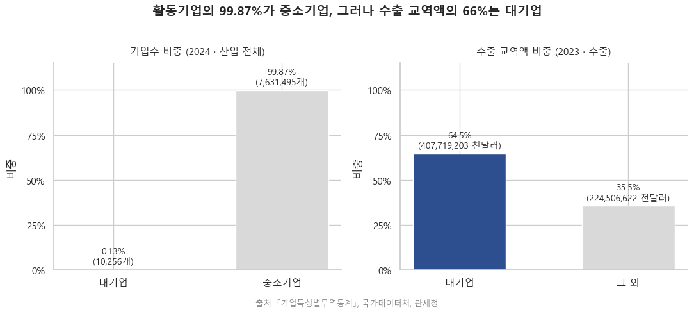

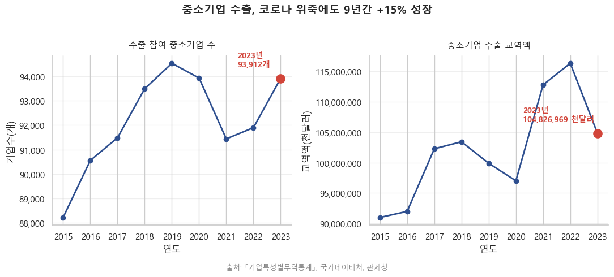

### AI 적용 의도

단순히 모델을 하나 만든 것이 아니라, **상품 등록 → 사람 연결 → 문서 질의 → 뉴스 확인**으로 이어지는 실제 서비스 흐름에 AI를 붙였다.

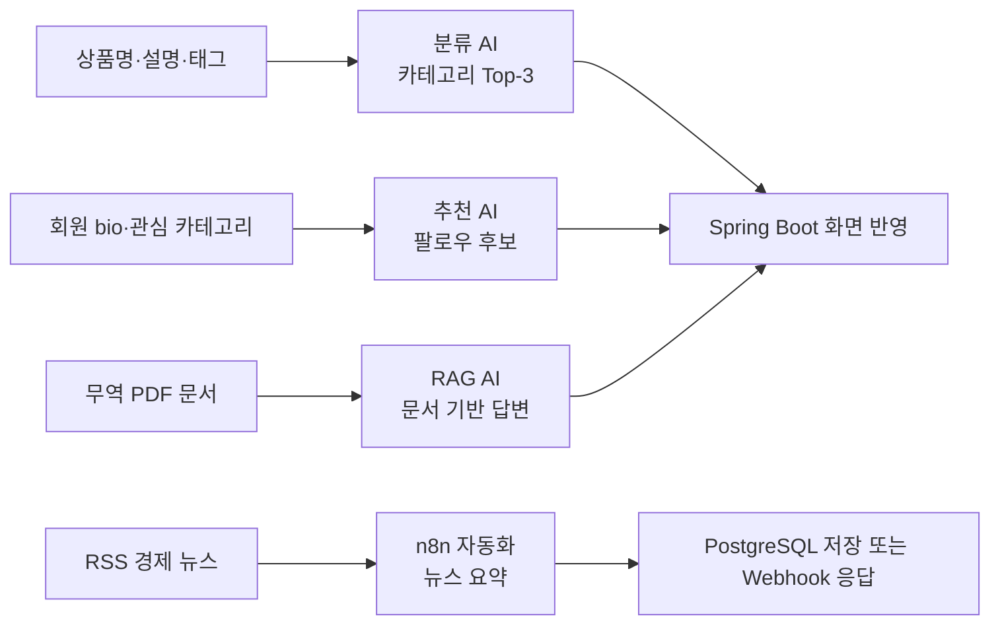

---

## 2. 데이터 준비 — 문제를 AI 입력으로 바꾸기

AI 기능별로 필요한 데이터가 다르기 때문에, 외부 수집 데이터와 서비스 내부 데이터를 분리했다.

| 구분 | 데이터 | 규모 | 사용 기능 |
|---|---|---:|---|
| 상품 텍스트 | 네이버 쇼핑 OpenAPI | 70,000건 | 상품 카테고리 분류 |
| 무역 텍스트 | 네이버 뉴스/블로그 OpenAPI | 112,000건 | 분류 데이터 보강 |
| 최종 학습셋 | 상품·무역 텍스트 통합 | 176,426건 | Naive Bayes 학습 |
| 벡터화 결과 | CountVectorizer 어휘 | 396,276개 | 텍스트 수치화 |
| 회원 관계 | 회원 데이터 | 508명 | 팔로우 추천 후보 |
| 소셜 그래프 | 팔로우 관계 | 2,422건 | 이미 연결된 회원 제외 |
| 관심사 | 회원-카테고리 관계 | 1,605건 | 관심 분야 유사도 계산 |
| 문서 | 실무형 무역 PDF | 315페이지 / 1,469청크 | RAG 문서 검색 |

### 전처리 관점

전처리는 개발 용어로 말하면 feature engineering이고, 발표에서는 **AI가 계산할 수 있도록 서비스 데이터를 문장·벡터·청크로 바꾸는 과정**이라고 설명하면 된다.

| 원본 데이터 | 전처리 결과 | AI 입력 |
|---|---|---|
| 상품명, 설명, 태그 | 하나의 상품 설명 문장 | 카테고리 분류 모델 |
| 회원 bio, 관심 카테고리 | 회원을 설명하는 프로필 문장 | 팔로우 추천 유사도 |
| PDF 문서 | 500자 단위 문서 청크 | RAG 검색 인덱스 |
| RSS 뉴스 | 제목과 본문을 합친 요약 대상 | n8n OpenAI 노드 |

---

## 3. 머신러닝 분류 — 상품 카테고리 Top-3 추천

> **목표**: 사용자가 상품명, 설명, 태그를 입력하면 가장 어울리는 카테고리 3개를 확률 순서로 추천한다.

### 왜 필요한가

상품 등록 화면에서 사용자가 카테고리를 직접 찾으면 시간이 오래 걸린다. GlobalGates는 입력된 상품 텍스트를 분석해서 카테고리 후보를 먼저 제시한다.

이 기능은 정답 하나를 강제로 고르는 모델이 아니라, **카테고리별 확률을 계산해 Top-3 후보를 보여주는 UX**다. 그래서 Accuracy뿐 아니라 AUC가 높은 모델이 적합했다.

### 모델 비교

| 모델 | Accuracy | Precision | Recall | F1 | AUC |
|---|---:|---:|---:|---:|---:|
| **CountVectorizer + MultinomialNB** | **0.9406** | **0.9429** | **0.9413** | **0.9408** | **0.9946** |
| CountVectorizer + DecisionTree | 0.9147 | 0.9176 | 0.9165 | 0.9150 | 0.9530 |

채택 이유는 명확했다.

1. Decision Tree보다 Accuracy, F1, AUC가 모두 높았다.
2. AUC가 0.9946으로 높아 Top-3 확률 추천에 적합했다.
3. train/test 차이가 2.7%p 수준이라 과적합 위험이 낮았다.
4. 라벨 단어를 제거한 검증 문장 10개에서도 10/10 정답을 기록했다.

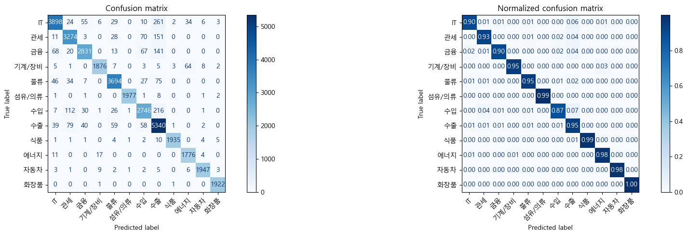

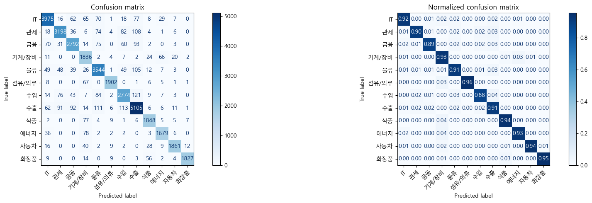

### 학습 코드 핵심

```python
m_nb_pipe = Pipeline([
    ("count_vectorizer", CountVectorizer()),
    ("multinomial_NB", MultinomialNB()),
])

m_nb_pipe.fit(X_train.values, y_train)
prediction = m_nb_pipe.predict(X_test.values)
proba = m_nb_pipe.predict_proba(X_test.values)
```

| 코드 | 의미 |
|---|---|
| `CountVectorizer()` | 문장을 단어 빈도 기반 숫자 벡터로 바꿈 |
| `MultinomialNB()` | 단어 출현 패턴을 보고 카테고리를 예측 |
| `predict_proba()` | 카테고리별 가능성을 확률로 반환 |

### FastAPI 적용 코드

```python
text = " ".join(value for value in [post_title, post_content, post_tag] if value)
probabilities = model.predict_proba([text])[0]
class_ids = list(model.classes_)

ranked_indices = sorted(
    range(len(probabilities)),
    key=lambda i: probabilities[i],
    reverse=True,
)[:3]
```

```python
predictions.append(
    CategoryPredictionItem(
        categoryName=category_name,
        score=round(float(probabilities[i]), 4),
    )
)
```

### 화면 적용 흐름

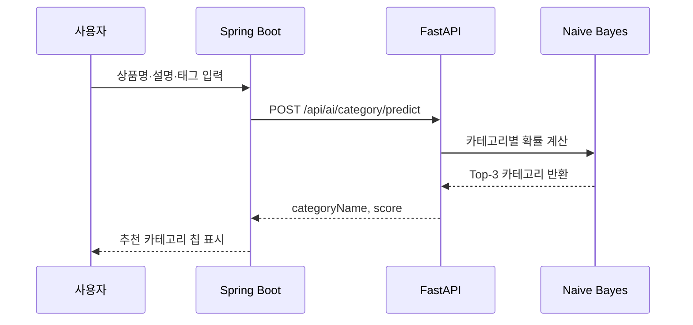

---

## 4. 머신러닝 추천 — 팔로우 추천

> **목표**: 회원의 자기소개와 관심 카테고리를 보고, 연결 가능성이 높은 회원을 추천한다.

### 추천에 사용한 데이터

| 데이터 | 규모 | 역할 |
|---|---:|---|
| 회원 데이터 | 508명 | 추천 후보 |
| 팔로우 관계 | 2,422건 | 이미 팔로우한 회원 제외 |
| 회원-카테고리 관계 | 1,605건 | 관심사 비교 |
| 노트북 검증 유사도 행렬 | 508 × 508 | 전체 회원 간 유사도 확인 |
| 화면 추천 개수 | Top-3 | 사용자에게 보여줄 추천 카드 |

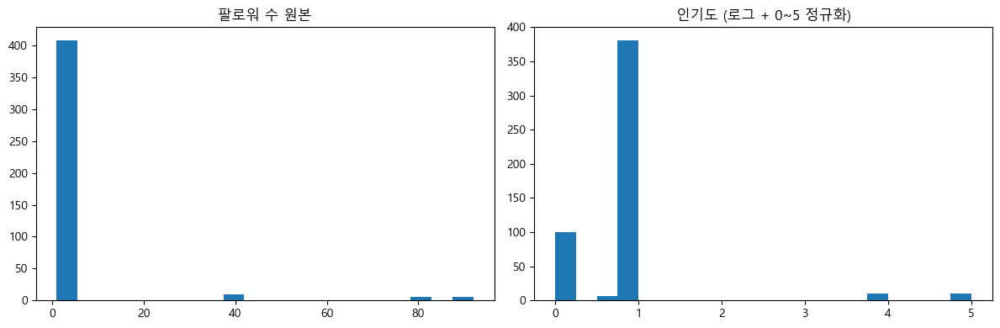


### 설계 판단

노트북에서는 `bio + category` 텍스트에 TF-IDF와 코사인 유사도를 적용해 추천 가능성을 검증했다. 실제 FastAPI 운영 코드에서는 회원 수가 작고 응답 속도가 중요하기 때문에, DB에서 후보를 가져온 뒤 **토큰 빈도 기반 코사인 유사도**로 가볍게 점수를 계산한다.

정보가 거의 없는 회원은 텍스트 유사도를 계산할 수 없으므로, 팔로워 수 기반 `cold_start` fallback을 둔다.

### 후보 필터링

추천은 단순히 유사한 사람을 찾는 것이 아니라, 서비스에서 보여주면 안 되는 후보를 먼저 제거한다.

| 필터 | 이유 |
|---|---|
| 자기 자신 제외 | 자기 자신을 추천하지 않음 |
| 이미 팔로우한 회원 제외 | 중복 추천 방지 |
| 내가 차단한 회원 제외 | 부적절한 노출 방지 |
| 나를 차단한 회원 제외 | 상대방 의사 반영 |
| 비활성 회원 제외 | 실제 연결 가능한 회원만 추천 |

### 운영 코드 핵심

```python
me_text = self.build_text(me)

if me_text:
    rows = self.rank_with_tfidf(me_text, rows)
else:
    rows.sort(key=lambda row: int(row.get("follower_count", 0)), reverse=True)
    for row in rows:
        row["score"] = float(row.get("follower_count", 0))
        row["candidate_source"] = "cold_start"
```

```python
common = set(me_counter) & set(counter)
dot = sum(me_counter[word] * counter[word] for word in common)
return dot / (me_norm * norm)
```

| 코드 | 의미 |
|---|---|
| `build_text()` | 회원 bio와 관심 카테고리를 하나의 문장으로 합침 |
| `rank_with_tfidf()` | 후보 회원과의 텍스트 유사도를 계산 |
| `cold_start` | 정보가 부족하면 팔로워 수 기준으로 임시 추천 |

### 추천 결과 흐름

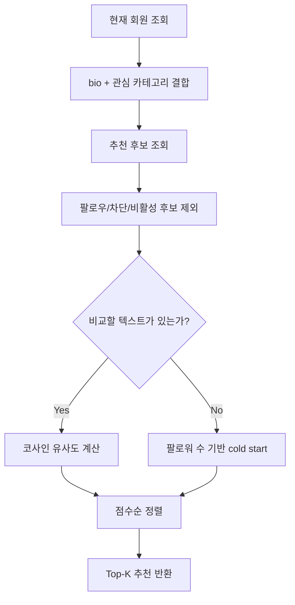

---

## 5. LLM RAG — 무역 문서 챗봇

> **목표**: 사용자가 무역 문서를 직접 뒤지지 않아도, PDF에서 관련 근거를 검색해 답변하는 챗봇을 제공한다.

### RAG 처리 규모

| 항목 | 수치 |
|---|---:|
| 실무형 PDF 문서 | 10개 기준 실습 |
| 전체 PDF 페이지 | 315페이지 |
| 분할 청크 수 | 1,469개 |
| 청크 크기 | 500자 |
| 청크 overlap | 50자 |
| 임베딩 차원 | 768 |
| 질의 방식 | Hybrid Query |

### RAG를 쉽게 설명하면

RAG는 LLM이 기억에 의존해 답하는 구조가 아니다. 먼저 문서에서 질문과 관련된 조각을 찾고, 그 조각을 근거로 답변하게 만든다.

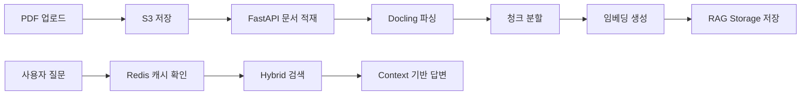

### 문서 적재 코드

```python
@router.post("/ingest", response_model=RagIngestResponse)
async def ingest(request: RagIngestRequest):
    await rag_service.ingest_document_from_s3(request.s3Key)
    return RagIngestResponse(message="문서 적재가 완료되었습니다.")
```

```python
with tempfile.TemporaryDirectory(prefix="globalgates-rag-") as temp_dir:
    local_path = Path(temp_dir) / f"source{suffix}"
    download_from_s3(cleaned, local_path)
    await self.ingest_document(str(local_path))
```

### 질의 코드

```python
result = await self._rag.aquery(
    cleaned,
    mode="hybrid",
    system_prompt=load_rag_system_prompt(),
)
```

### 환각 방지 프롬프트

RAG 답변은 `prompt/prompt.yml`에 정의된 규칙을 따른다.

| 원칙 | 내용 |
|---|---|
| Context 제한 | 제공된 검색 문맥만 사용 |
| 추측 금지 | 문서에 없는 내용은 만들지 않음 |
| 불확실성 표시 | 확인 불가 시 "제공된 문서에서는 확인할 수 없습니다."라고 답변 |
| 한국어 응답 | 모든 답변은 한국어로 작성 |
| 숫자·날짜 보존 | 문서에 나온 수치와 조건을 최대한 정확히 유지 |

### 캐시 전략

같은 질문이나 의미가 비슷한 질문은 Redis semantic cache에서 먼저 찾는다. 캐시가 맞으면 RAG와 LLM 호출을 생략하고 바로 답변한다.

```python
cached_answer, _score = search_similar_question(cleaned)
if cached_answer is not None:
    return {
        "answer": cached_answer,
        "cached": True,
        "sources": [],
    }

answer = await rag_service.ask(cleaned)
save_question_answer(cleaned, answer)
```

---

## 6. n8n 자동화 — 해외 경제 뉴스 요약

> **목표**: RSS 경제 뉴스를 자동 수집하고, OpenAI로 한국어 요약을 만든 뒤 Webhook 응답 또는 DB 저장까지 연결한다.

### 워크플로우

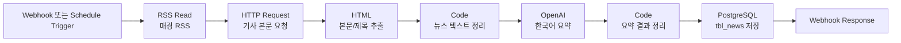

### 실제 노드 구성

| 노드 | 역할 |
|---|---|
| `Schedule Trigger` | 매일 09:00 실행 가능 |
| `Webhook` | 수동 실행 또는 외부 호출 |
| `RSS Read` | `https://www.mk.co.kr/rss/30100041/` 수집 |
| `HTTP Request` | 기사 링크 본문 요청 |
| `HTML` | `.view_head_title`, `.news_cnt_detail_wrap` 추출 |
| `OpenAI` | `gpt-5.4-nano`로 요약 생성 |
| `PostgreSQL` | `tbl_news.news_contents` 저장 |

### 프롬프트 정책

```text
너는 경제 뉴스 요약기이다. 아래 기사를 한국어로 간결하게 요약하라.

[요약 규칙]
1) 뉴스별로 1줄 요약
2) '1) [뉴스 1]'과 같은 구분점 없이 오로지 줄바꿈으로만 구분한다.
3) 과장/추측 금지, 기사에 있는 사실만
4) 투자 추천/매수·매도 조언 금지
```

n8n은 모델 학습 기능은 아니지만, 서비스 밖의 정보를 자동으로 가져와 운영 데이터로 바꾸는 AI 자동화 사례다.

---

## 7. 서비스 연동 구조

GlobalGates는 화면과 핵심 비즈니스 로직은 Spring Boot가 담당하고, AI 추론과 RAG 처리는 FastAPI가 담당한다.

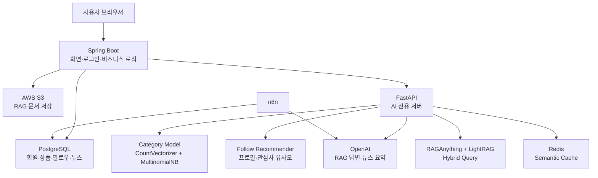

### API 연결표

| 기능 | Spring 쪽 호출 | FastAPI API | 반환 |
|---|---|---|---|
| 상품 카테고리 추천 | 상품 등록 화면 | `POST /api/ai/category/predict` | 카테고리 Top-3, score |
| 팔로우 추천 | 추천 회원 영역 | `POST /api/ai/follow/recommend` | 추천 회원 ID, score, rank |
| RAG 문서 적재 | 관리자 PDF 업로드 | `POST /api/rag/ingest` | 문서 적재 완료 메시지 |
| AI 챗봇 | 챗봇 질문 | `POST /api/chat/query` | 답변, cached 여부 |
| RAG 직접 질의 | 내부 검증 | `POST /api/rag/query` | RAG 답변 |

### FastAPI 시작 시 초기화

```python
@asynccontextmanager
async def lifespan(app: FastAPI):
    await db.connect()
    ai_service.load_follow_artifacts()
    await rag_service.initialize()
    yield
    await db.disconnect()
```

---

## 8. AI 파트 전체 요약

| 파트 | 핵심 기술 | 구현 결과 | 발표 포인트 |
|---|---|---|---|
| 데이터 분석 | KOSIS + pandas | 수출 구조 문제를 시각화 | 왜 GlobalGates가 필요한지 설명 |
| 상품 분류 | CountVectorizer + MultinomialNB | Accuracy 0.9406, AUC 0.9946 | 카테고리 Top-3 추천 UX에 연결 |
| 팔로우 추천 | 프로필/관심사 코사인 유사도 | 508명 후보에서 Top-K 추천 | 팔로우·차단 관계까지 반영 |
| RAG 챗봇 | RAGAnything + LightRAG + Redis | 315페이지, 1,469청크 검색 | 문서 근거 기반 답변과 캐시 |
| n8n 자동화 | RSS + OpenAI + PostgreSQL | 경제 뉴스 요약 자동화 | 외부 시장 정보를 운영 데이터로 전환 |
| 서비스 연동 | Spring Boot + FastAPI | 주요 AI API 화면 연결 | 실험이 아니라 서비스 기능으로 구현 |

### 발표에서 강조할 말

1. **AI 모델 실험에서 끝내지 않고 실제 서비스 화면과 API에 연결했다.**
2. **상품 분류는 176,426건 학습 데이터로 0.94 수준의 정확도와 0.99 수준의 AUC를 확보했다.**
3. **추천은 회원 프로필, 관심 카테고리, 팔로우/차단 관계를 함께 반영했다.**
4. **RAG는 PDF 업로드, S3 저장, 문서 적재, 문서 기반 답변까지 운영 흐름으로 구현했다.**
5. **n8n은 외부 경제 뉴스를 자동 수집·요약해 서비스 운영 데이터로 확장한 사례다.**

### 한 줄 결론

> GlobalGates AI는 상품을 **분류**하고, 사람을 **추천**하고, 문서를 **질의**하고, 뉴스를 **자동 요약**하여 중소기업의 글로벌 B2B 활동을 더 빠르고 정확하게 돕는 서비스형 AI 구조다.
