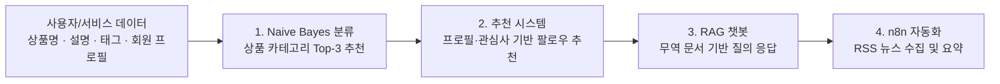
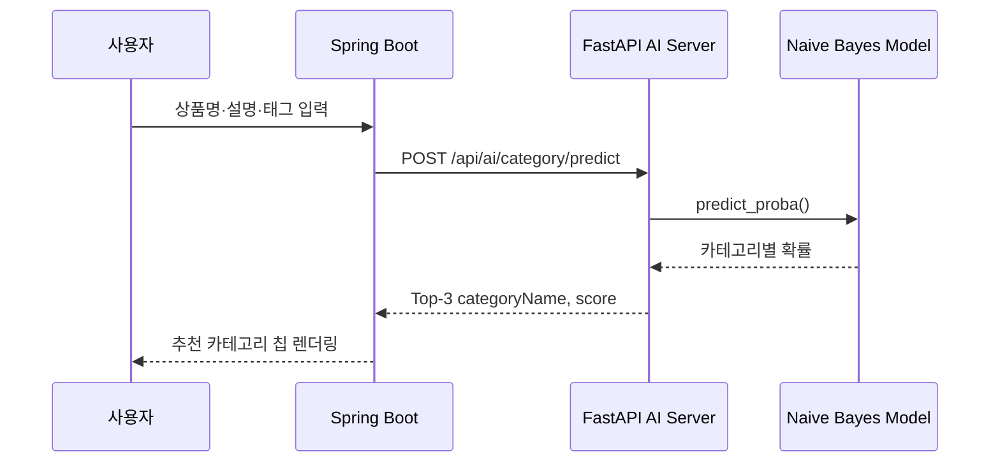
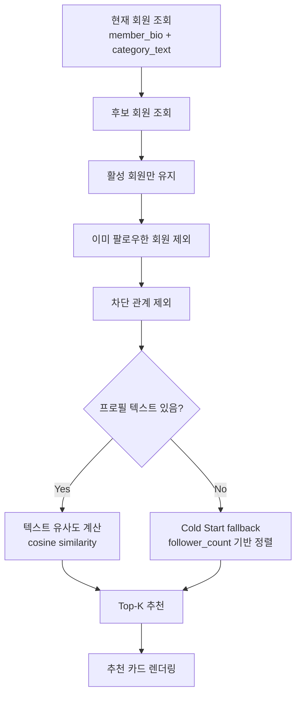
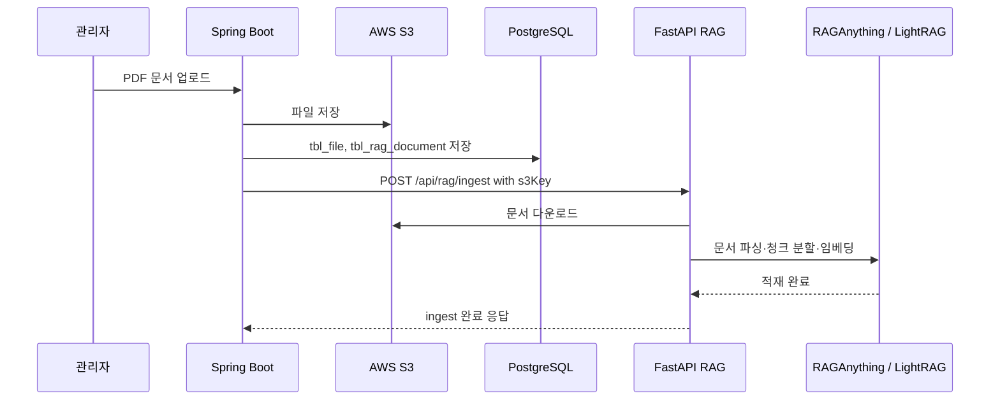
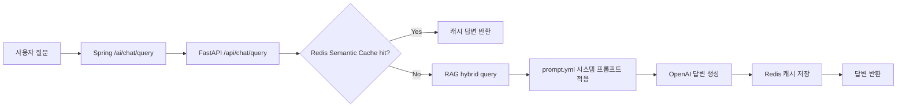
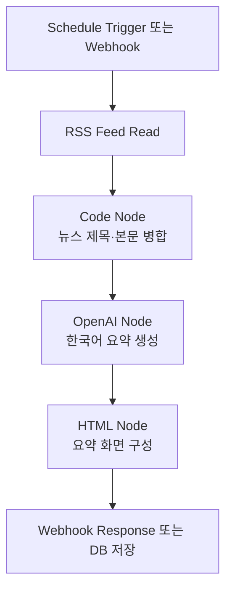
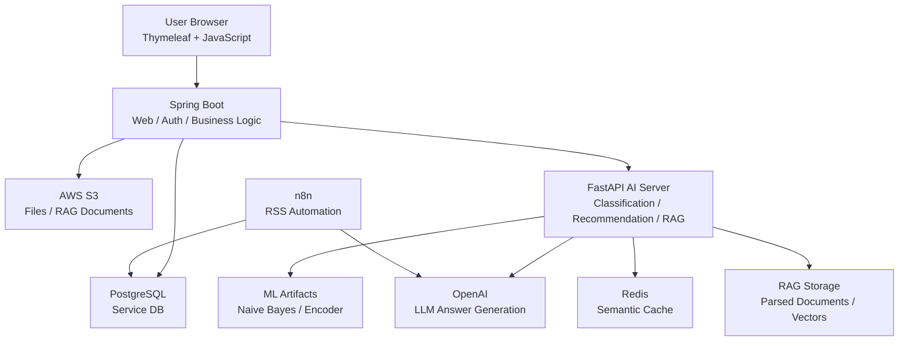

# GlobalGates — AI 발표 자료

> **"AI로 연결하는 글로벌 B2B 비즈니스 소셜 마켓"**
>
> 중소기업의 해외 판로 개척, 바이어 탐색, 무역 정보 접근 문제를
> **Naive Bayes 분류**, **프로필 기반 추천**, **RAG 챗봇**, **n8n 자동화**로 풀어낸 GlobalGates AI 구현 자료입니다.


---

## 목차

1. [기획 배경 & 의도](#1-기획-배경--의도)
2. [데이터 수집 및 전처리 — 네이버 OpenAPI와 서비스 데이터 구성](#2-데이터-수집-및-전처리--네이버-openapi와-서비스-데이터-구성)
3. [머신러닝 (분류) — Naive Bayes 기반 상품 카테고리 추천](#3-머신러닝-분류--naive-bayes-기반-상품-카테고리-추천)
4. [머신러닝 (추천) — 프로필 기반 팔로우 추천 시스템](#4-머신러닝-추천--프로필-기반-팔로우-추천-시스템)
5. [LLM (RAG) — 무역 문서 기반 AI 챗봇](#5-llm-rag--무역-문서-기반-ai-챗봇)
6. [LLM (n8n) — RSS 뉴스 요약 자동화](#6-llm-n8n--rss-뉴스-요약-자동화)
7. [서비스 연동 — Spring Boot와 FastAPI 연결 구조](#7-서비스-연동--spring-boot와-fastapi-연결-구조)
8. [구현 결과 & 발표 핵심 포인트](#8-구현-결과--발표-핵심-포인트)

---

## 1. 기획 배경 & 의도

### GlobalGates의 문제의식

중소기업은 제품 경쟁력이 있어도 해외 바이어를 찾고, 상품을 적절한 카테고리에 노출하고, 국가별 통관/FTA/수출입 문서를 이해하는 데 높은 비용을 부담합니다.

GlobalGates는 이 문제를 **B2B 소셜 마켓 + AI 보조 기능**으로 해결하려는 플랫폼입니다.

| 문제 | AI 적용 방향 | 서비스 가치 |
|---|---|---|
| 상품이 적절한 카테고리에 노출되지 않음 | 상품명·설명·태그 기반 카테고리 자동 추천 | 등록 마찰 감소, 검색 품질 개선 |
| 관심사와 거래 목적이 맞는 사용자를 찾기 어려움 | 프로필·관심 카테고리 기반 팔로우 추천 | 바이어/셀러 연결 가능성 확대 |
| 무역 문서와 통관 정보를 직접 찾기 어려움 | RAG 기반 문서 질의 챗봇 | 실무 문서 탐색 비용 절감 |
| 외부 경제/무역 뉴스를 계속 확인하기 번거로움 | n8n 기반 RSS 수집 및 AI 요약 | 시장 시그널 자동 수집 |

### AI 적용 흐름



핵심은 AI 기능을 따로 실험하는 데서 끝내지 않고, **실제 화면에서 발생하는 입력 → AI 추론 → 서비스 UI 반영**까지 연결했다는 점입니다.

---

## 2. 데이터 수집 및 전처리 — 네이버 OpenAPI와 서비스 데이터 구성

> **목표**: 상품 카테고리 분류와 추천 시스템에 필요한 텍스트 데이터를 만들고, 실제 서비스 DB 데이터를 AI 기능에 연결 가능한 형태로 정리

### 데이터 규모

| 데이터 | 규모 | 사용 목적 |
|---|---:|---|
| 네이버 쇼핑 OpenAPI | 70,000건 | 상품명·브랜드·제조사 기반 카테고리 분류 |
| 네이버 뉴스/블로그 OpenAPI | 112,000건 | 무역 행위 중심 텍스트 보강 |
| 전체 원천 텍스트 | 182,000건 | 분류 모델 학습 후보 |
| 최종 학습 데이터 | 176,426건 | 결측/노이즈 제거 후 모델 학습 |
| CountVectorizer 어휘 수 | 396,276개 | 텍스트 벡터화 |
| 분류 카테고리 | 12개 | GlobalGates 1단계 카테고리 |

### 데이터별 역할

| 데이터 | 출처 | 전처리 방식 | 연결 기능 |
|---|---|---|---|
| 상품 텍스트 | 네이버 쇼핑 OpenAPI | `title + brand + maker` 결합 | 상품 카테고리 분류 |
| 뉴스/블로그 텍스트 | 네이버 뉴스·블로그 OpenAPI | `title + description` 결합, 1단계 라벨 추출 | 무역 행위 텍스트 보강 |
| 회원 프로필 | PostgreSQL `tbl_member` | `member_bio` 정규화 | 팔로우 추천 |
| 관심 카테고리 | PostgreSQL `tbl_member_category_rel` | 회원별 `category_text` 집계 | 팔로우 추천 |
| 팔로우/차단 관계 | PostgreSQL `tbl_follow`, `tbl_block` | 이미 연결된 회원과 차단 관계 제외 | 추천 후보 필터링 |
| 무역 PDF 문서 | 관리자 업로드/S3 | 문서 파싱, 청크 분할, 임베딩 | RAG 챗봇 |

### 분석 노트북

| 목적 | 노트북 경로 |
|---|---|
| 네이버 쇼핑 데이터 수집 | `C:\gb_0900_hsh\ai\workspace\project\02_collect_naver_openapi.ipynb` |
| 뉴스/블로그 데이터 수집 | `C:\gb_0900_hsh\ai\workspace\project\datasets\03_collect_naver_news_blog.ipynb` |
| 상품 카테고리 분류 모델 | `C:\gb_0900_hsh\ai\workspace\project\globalgates_category_classifier.ipynb` |
| 추천 시스템 검증 | `C:\gb_0900_hsh\ai\workspace\project\globalgates_follower_recommender_profile_score.ipynb` |
| RAG 인덱스 생성 실험 | `C:\gb_0900_hsh\ai\workspace\project\RAG\02_build_trade_regulation_rag_redis.ipynb` |
| n8n 워크플로우 | `C:\gb_0900_hsh\ai\workspace\project\n8n-news\n8n_news_hsh.json` |

---

## 3. 머신러닝 (분류) — Naive Bayes 기반 상품 카테고리 추천

> **목표**: 상품명, 설명, 태그를 입력하면 GlobalGates 서비스 카테고리 Top-3를 추천

### 모델 개요

| 항목 | 내용 |
|---|---|
| 문제 유형 | 다중 분류 |
| 예측 대상 | GlobalGates 1단계 카테고리 12개 |
| 학습 데이터 | 네이버 쇼핑·뉴스·블로그 기반 최종 176,426건 |
| 벡터화 | `CountVectorizer` |
| 모델 | `MultinomialNB` |
| 산출물 | `globalgates_category_model.pkl`, `globalgates_category_encoder.pkl` |

### 성능 비교

| 모델 | Accuracy | Precision | Recall | F1 | AUC |
|---|---:|---:|---:|---:|---:|
| **CountVectorizer + MultinomialNB** | **0.9406** | 0.9429 | 0.9413 | **0.9408** | **0.9946** |
| CountVectorizer + DecisionTree | 0.9147 | 0.9176 | 0.9165 | 0.9150 | 0.9530 |

Naive Bayes는 Decision Tree보다 Accuracy, F1, AUC 모두 높았습니다. 특히 AUC가 약 **0.995**로 높아, 단일 정답뿐 아니라 **Top-3 추천 UX에 필요한 확률 순위**가 안정적이라고 판단했습니다.

### 핵심 코드

```python
m_nb_pipe = Pipeline([
    ("count_vectorizer", CountVectorizer()),
    ("naive_bayes", MultinomialNB()),
])

m_nb_pipe.fit(X_train.values, y_train)
prediction = m_nb_pipe.predict(X_test.values)
proba = m_nb_pipe.predict_proba(X_test.values)
```

### 서비스 적용 흐름



### 화면 연결

| 구분 | 경로 |
|---|---|
| 화면 JS | `src/main/resources/static/js/mypage/event.js` |
| Spring Controller | `src/main/java/com/app/globalgates/controller/ai/AIController.java` |
| FastAPI Router | `C:\gb_0900_hsh\fastapi\workspace\globalgates\router\ai.py` |
| FastAPI Service | `C:\gb_0900_hsh\fastapi\workspace\globalgates\service\ai_service.py` |

---

## 4. 머신러닝 (추천) — 프로필 기반 팔로우 추천 시스템

> **목표**: 사용자 자기소개, 관심 카테고리, 팔로우/차단 관계를 바탕으로 연결 가능성이 높은 회원 추천

### 서비스 데이터 규모

| 데이터 | 규모 | 역할 |
|---|---:|---|
| 회원 데이터 | 508명 | 추천 대상 후보 |
| 팔로우 관계 | 2,422건 | 이미 연결된 회원 제외 |
| 회원-카테고리 관계 | 1,605건 | 관심사 텍스트 구성 |
| TF-IDF 유사도 행렬 | 508 × 508 | 회원 간 프로필 유사도 계산 |
| 화면 추천 개수 | Top-3 | 추천 카드 노출 |

### 추천 로직



### 핵심 설계

| 설계 포인트 | 설명 |
|---|---|
| 추천 텍스트 | `member_bio + 관심 카테고리`를 결합 |
| 후보 필터링 | 본인, 기존 팔로우, 차단 관계 제외 |
| 유사도 | 프로필 텍스트 기반 cosine similarity |
| Cold Start | 프로필 텍스트가 없으면 팔로워 수 기반 fallback |
| 운영 Top-K | FastAPI 기본 5개, Spring 화면에서는 Top-3 요청 |

### FastAPI 운영 구현

노트북에서는 `TF-IDF + cosine_similarity`로 추천 가능성을 검증했고, 운영 FastAPI에서는 DB에서 후보를 조회한 뒤 현재 회원 텍스트와 후보 텍스트의 cosine similarity를 계산합니다.

```python
me_text = self.build_text(me)

if me_text:
    rows = self.rank_with_tfidf(me_text, rows)
else:
    rows.sort(key=lambda row: int(row.get("follower_count", 0)), reverse=True)
    for row in rows:
        row["score"] = float(row.get("follower_count", 0))
        row["candidate_source"] = "cold_start"
```

### 화면 연결

| 구분 | 경로 |
|---|---|
| 추천 요청 JS | `src/main/resources/static/js/common/recommendation-service.js` |
| 추천 렌더링 JS | `src/main/resources/static/js/common/recommendation-event.js` |
| Spring Controller | `src/main/java/com/app/globalgates/controller/ai/AIController.java` |
| Spring Service | `src/main/java/com/app/globalgates/service/AIService.java` |
| FastAPI Service | `C:\gb_0900_hsh\fastapi\workspace\globalgates\service\follow_service.py` |
| FastAPI Repository | `C:\gb_0900_hsh\fastapi\workspace\globalgates\repository\follow_repository.py` |

---

## 5. LLM (RAG) — 무역 문서 기반 AI 챗봇

> **목표**: 수출입/통관/FTA 문서를 검색 가능한 지식 기반으로 만들고, 사용자가 자연어로 질문할 수 있도록 구현

### RAG 문서 처리 규모

| 항목 | 수치 |
|---|---:|
| 실무형 PDF 문서 | 11개 |
| 전체 PDF 페이지 | 315페이지 |
| 분할 청크 수 | 1,469개 |
| 청크 크기 | 500자 |
| 청크 overlap | 50자 |
| 임베딩 차원 | 768 |
| 질의 방식 | Hybrid Query |

### RAG 처리 흐름



### 기술 구성

| 구성 | 사용 기술 |
|---|---|
| 문서 파싱 | RAGAnything, Docling |
| 검색 엔진 | LightRAG hybrid query |
| 임베딩 | HuggingFace `jhgan/ko-sbert-nli` |
| 답변 생성 | OpenAI 모델 |
| 캐시 | Redis Semantic Cache |
| 파일 저장 | AWS S3 |
| 메타 저장 | PostgreSQL `tbl_file`, `tbl_rag_document` |

### 챗봇 질의 흐름



### 화면 연결

| 구분 | 경로 |
|---|---|
| 전역 AI 챗봇 화면 | `src/main/resources/templates/video_ai/video_ai.html` |
| 전역 AI 챗봇 JS | `src/main/resources/static/js/video_ai/event.js` |
| 관리자 RAG 업로드 API | `src/main/java/com/app/globalgates/controller/admin/AdminRagAPIController.java` |
| Spring RAG Service | `src/main/java/com/app/globalgates/service/RagService.java` |
| FastAPI RAG Router | `C:\gb_0900_hsh\fastapi\workspace\globalgates\router\rag.py` |
| FastAPI RAG Service | `C:\gb_0900_hsh\fastapi\workspace\globalgates\service\RAG_service.py` |

---

## 6. LLM (n8n) — RSS 뉴스 요약 자동화

> **목표**: 외부 경제/무역 뉴스를 자동 수집하고 OpenAI로 한국어 요약을 생성

### n8n 워크플로우 구성

| 워크플로우 | 노드 수 | 주요 노드 |
|---|---:|---|
| Webhook 기반 뉴스 요약 | 8개 | RSS Feed Read, Code, OpenAI, HTML, HTTP Request, Webhook Response |
| Schedule 기반 확장 워크플로우 | 10개 | Schedule Trigger, RSS Feed Read, OpenAI, PostgreSQL, Webhook Response |

### 자동화 흐름



### 프롬프트 정책

| 규칙 | 내용 |
|---|---|
| 요약 단위 | 뉴스별 1줄 요약 |
| 사실성 | 기사에 있는 사실만 사용 |
| 안전성 | 과장/추측 금지 |
| 금융 리스크 | 투자 추천, 매수·매도 조언 금지 |

### n8n 관련 파일

| 파일 | 역할 |
|---|---|
| `C:\gb_0900_hsh\ai\workspace\project\n8n-news\docker-compose.yml` | n8n 실행 환경 |
| `C:\gb_0900_hsh\ai\workspace\project\n8n-news\n8n_news_hsh.json` | Webhook 기반 뉴스 요약 워크플로우 |
| `C:\gb_0900_hsh\ai\workspace\project\n8n-news\My workflow copy2.json` | Schedule/PostgreSQL 확장 워크플로우 |

---

## 7. 서비스 연동 — Spring Boot와 FastAPI 연결 구조

Spring Boot는 사용자가 보는 화면, 인증, DB 중심 비즈니스 로직을 담당하고, FastAPI는 AI 추론과 RAG 처리를 담당합니다.



### API 연결 표

| 기능 | Spring 경로 | FastAPI 경로 | 설명 |
|---|---|---|---|
| 카테고리 추천 | `/ai/category/predict` | `/api/ai/category/predict` | 상품 텍스트 기반 카테고리 Top-3 |
| 팔로우 추천 | `/ai/follow/recommend/{memberId}` | `/api/ai/follow/recommend` | 추천 회원 목록 반환 |
| AI 챗봇 | `/ai/chat/query` | `/api/chat/query` | RAG 기반 답변 |
| RAG 문서 적재 | `/api/admin/rag/documents` | `/api/rag/ingest` | 관리자 문서 업로드 및 적재 |

### 실행 기준

| 구분 | 위치 | 실행 |
|---|---|---|
| Spring Boot | `C:\gb_0900_hsh\aws\workspace\globalgates` | `./gradlew bootRun` |
| FastAPI | `C:\gb_0900_hsh\fastapi\workspace\globalgates` | `uvicorn main:app --reload` |
| n8n | `C:\gb_0900_hsh\ai\workspace\project\n8n-news` | `docker compose up -d` |

---

## 8. 구현 결과 & 발표 핵심 포인트

### 구현 결과 요약

| 영역 | 구현 결과 | 정량 근거 |
|---|---|---|
| 분류 | 상품 등록 화면에서 카테고리 Top-3 추천 | 176,426건 학습, Accuracy 0.9406, AUC 0.9946 |
| 추천 | 프로필/관심사 기반 팔로우 추천 | 회원 508명, 팔로우 2,422건, 관계 1,605건 |
| RAG | 관리자 PDF 업로드 후 무역 문서 챗봇 질의 | PDF 11개, 315페이지, 1,469청크 |
| n8n | RSS 뉴스 수집 및 OpenAI 요약 자동화 | 8노드 Webhook 워크플로우, 10노드 Schedule 확장 |
| 연동 | Spring 화면과 FastAPI AI 서버 연결 | WebClient 기반 4개 주요 AI API 연동 |

### 발표에서 강조할 포인트

1. **단순 모델 실험이 아니라 실제 서비스 화면에 연결된 AI 기능**
   - 상품 등록 화면에서 바로 카테고리 추천 결과가 렌더링됩니다.

2. **Naive Bayes를 선택한 이유가 명확함**
   - 텍스트 분류에서 빠르고 안정적이며, Decision Tree 대비 성능도 더 높았습니다.

3. **추천 시스템은 서비스 DB 구조와 직접 연결됨**
   - 회원, 관심 카테고리, 팔로우, 차단 관계를 모두 반영합니다.

4. **RAG는 운영 흐름까지 고려함**
   - 관리자 업로드, S3 저장, 문서 메타 상태 관리, FastAPI ingest까지 연결했습니다.

5. **n8n으로 AI 기능을 서비스 밖 자동화까지 확장함**
   - RSS 뉴스 수집, OpenAI 요약, HTML/Webhook 응답까지 하나의 워크플로우로 구성했습니다.

### 한 줄 결론

> GlobalGates AI는 상품을 **분류**하고, 사람을 **추천**하고, 문서를 **질의**하고, 뉴스를 **자동 요약**하여  
> 중소기업의 글로벌 B2B 활동을 더 빠르고 정확하게 돕는 서비스형 AI 구조입니다.

