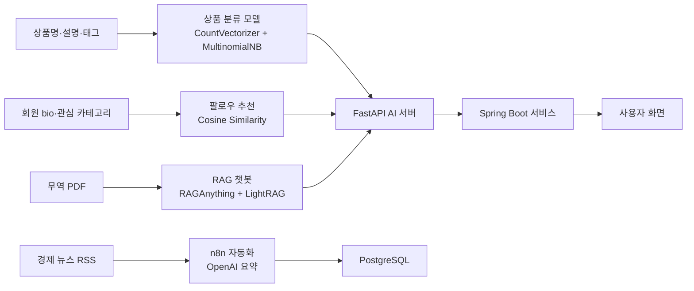
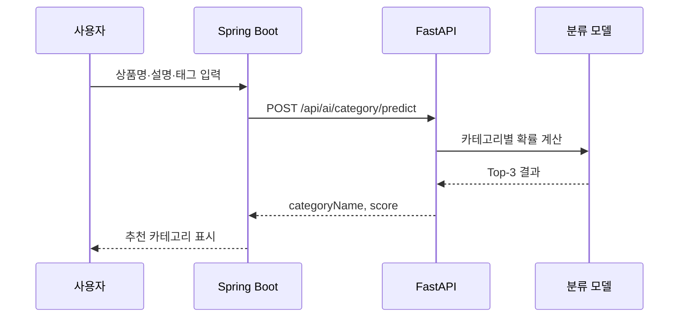
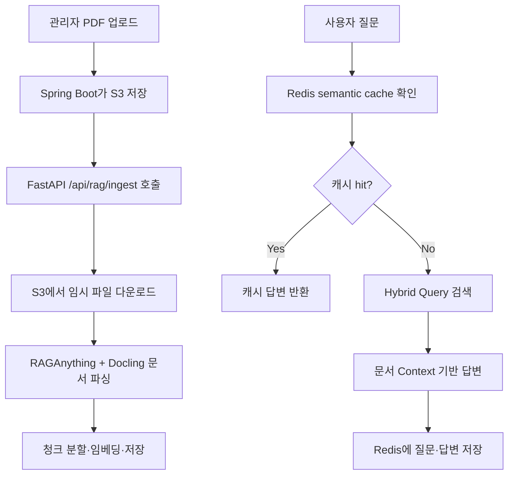
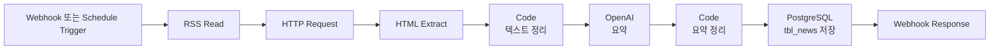
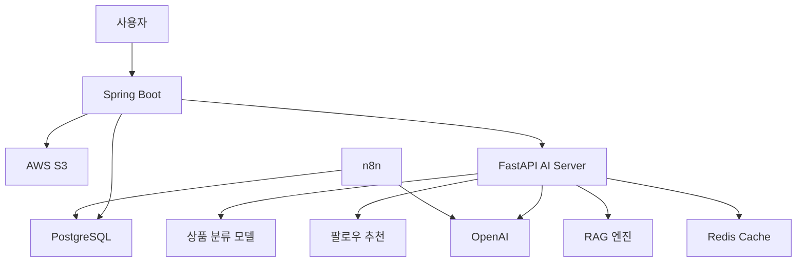

# GlobalGates — AI 발표 자료

> **피드로 여는 기업용 비즈니스 소셜 마켓**
>
> 중소기업의 해외 진출 과정에서 반복되는 상품 노출, 파트너 탐색, 무역 문서 이해, 시장 뉴스 추적 문제를 AI 기능으로 줄이는 서비스

---

## 발표 흐름

1. [기획 배경](#1-기획-배경)
2. [AI 전체 구조](#2-ai-전체-구조)
3. [데이터 준비](#3-데이터-준비)
4. [상품 카테고리 분류](#4-상품-카테고리-분류)
5. [팔로우 추천](#5-팔로우-추천)
6. [무역 문서 RAG 챗봇](#6-무역-문서-rag-챗봇)
7. [n8n 뉴스 자동화](#7-n8n-뉴스-자동화)
8. [Spring Boot ↔ FastAPI 연동](#8-spring-boot--fastapi-연동)
9. [최종 정리](#9-최종-정리)

---

## 1. 기획 배경

### 문제 정의

한국 수출 구조는 중소기업 수가 많다는 사실과 별개로, 실제 수출 성과는 일부 기업과 일부 시장에 집중되어 있다. GlobalGates는 이 구조에서 중소기업이 겪는 병목을 네 가지로 봤다.

| 병목 | 실제 사용자 상황 | AI로 줄인 부분 |
|---|---|---|
| 상품 노출 | 상품을 등록해도 어떤 카테고리에 올려야 할지 애매함 | 상품명·설명·태그 기반 카테고리 Top-3 추천 |
| 거래 연결 | 바이어·셀러 후보가 많아도 누구와 연결해야 할지 모름 | 회원 프로필·관심 카테고리 기반 팔로우 추천 |
| 정보 탐색 | 통관·수출입 문서를 직접 읽기 어렵고 시간이 오래 걸림 | PDF 문서 기반 RAG 챗봇 |
| 시장 추적 | 해외 경제 뉴스를 계속 모니터링하기 어려움 | RSS 수집 후 OpenAI 요약 자동화 |


### 기획 의도

이 프로젝트의 AI는 별도 데모가 아니라 서비스 흐름 안에 들어간다.

사용자는 상품을 등록하고, 사람을 추천받고, 무역 문서를 질문하고, 시장 뉴스를 확인한다. AI는 이 네 지점에서 사용자의 판단 비용을 줄인다.

> 핵심 메시지: **GlobalGates AI는 모델 실험이 아니라 글로벌 B2B 서비스의 실제 기능으로 연결된 AI 파이프라인이다.**

---

## 2. AI 전체 구조



### AI 기능별 역할

| 기능 | 입력 | 처리 | 출력 |
|---|---|---|---|
| 상품 분류 | 상품명, 본문, 태그 | 카테고리별 확률 계산 | Top-3 카테고리 |
| 팔로우 추천 | 회원 bio, 관심 카테고리, 팔로우/차단 관계 | 후보 필터링 후 유사도 계산 | 추천 회원 목록 |
| RAG 챗봇 | PDF 문서, 사용자 질문 | 문서 검색 후 근거 기반 답변 | 한국어 답변 |
| n8n 자동화 | RSS 기사 | 본문 추출 후 요약 | 뉴스 요약 저장 |

---

## 3. 데이터 준비

AI 기능별로 필요한 데이터가 다르기 때문에, 외부 수집 데이터와 서비스 DB 데이터를 함께 사용했다.

| 데이터 | 규모 | 사용 위치 | 의미 |
|---|---:|---|---|
| 네이버 쇼핑 OpenAPI | 70,000건 | 상품 분류 | 상품명·카테고리 중심 텍스트 |
| 네이버 뉴스/블로그 OpenAPI | 112,000건 | 상품 분류 보강 | 수출·수입·물류·관세·금융 텍스트 |
| 최종 분류 학습 데이터 | 176,426건 | Naive Bayes 학습 | 상품/무역 텍스트 통합 학습셋 |
| CountVectorizer 어휘 | 396,276개 | 분류 모델 | 문장을 숫자 벡터로 변환 |
| 회원 데이터 | 508명 | 팔로우 추천 | 추천 대상 회원 풀 |
| 팔로우 관계 | 2,422건 | 팔로우 추천 | 이미 연결된 회원 제외 |
| 회원-카테고리 관계 | 1,605건 | 팔로우 추천 | 관심사 기반 유사도 |
| 무역 PDF | 315페이지 | RAG | 문서 기반 답변 소스 |
| RAG 청크 | 1,469개 | RAG | 검색 단위 |

### 전처리 방식

| 원본 | 전처리 | 이유 |
|---|---|---|
| 상품명 + 설명 + 태그 | 하나의 문장으로 결합 | 모델이 상품 맥락을 한 번에 보도록 함 |
| 회원 bio + 관심 카테고리 | 프로필 문장으로 결합 | 비슷한 목적의 회원을 찾기 위함 |
| PDF 문서 | 500자 청크, 50자 overlap | 검색 시 문맥이 끊기지 않게 함 |
| RSS 기사 | 제목·본문 추출 후 특수문자 정리 | 요약 프롬프트 입력을 안정화 |

---

## 4. 상품 카테고리 분류

> **목표**: 상품 등록 시 사용자가 직접 카테고리를 찾지 않아도, 상품명·설명·태그만으로 적합한 카테고리 후보를 제시한다.

### 왜 분류 모델을 썼는가

상품 카테고리는 정답을 하나만 맞히는 것보다, 화면에서 사용자가 고를 수 있는 후보를 보여주는 것이 더 자연스럽다. 그래서 모델은 최종 카테고리 하나가 아니라 **확률이 높은 Top-3 카테고리**를 반환한다.

### 모델 비교 결과

| 모델 | Accuracy | Precision | Recall | F1 | AUC |
|---|---:|---:|---:|---:|---:|
| **CountVectorizer + MultinomialNB** | **0.9406** | **0.9429** | **0.9413** | **0.9408** | **0.9946** |
| CountVectorizer + DecisionTree | 0.9147 | 0.9176 | 0.9165 | 0.9150 | 0.9530 |

Naive Bayes를 선택한 이유는 세 가지다.

1. Decision Tree보다 모든 주요 지표가 높았다.
2. AUC가 0.9946으로 높아 Top-3 확률 추천에 적합했다.
3. train/test 점수 차이가 2.7%p 수준이라 과적합 위험이 낮았다.


### 학습 코드 핵심

```python
m_nb_pipe = Pipeline([
    ("count_vectorizer", CountVectorizer()),
    ("multinomial_NB", MultinomialNB()),
])

m_nb_pipe.fit(X_train.values, y_train)
prediction = m_nb_pipe.predict(X_test.values)
proba = m_nb_pipe.predict_proba(X_test.values)
```

### FastAPI 적용

```python
text = " ".join(value for value in [post_title, post_content, post_tag] if value)
probabilities = model.predict_proba([text])[0]
class_ids = list(model.classes_)

ranked_indices = sorted(
    range(len(probabilities)),
    key=lambda i: probabilities[i],
    reverse=True,
)[:3]
```

```python
CategoryPredictionItem(
    categoryName=category_name,
    score=round(float(probabilities[i]), 4),
)
```

### 서비스 흐름



---

## 5. 팔로우 추천

> **목표**: 사용자가 GlobalGates 안에서 연결할 만한 바이어·셀러 후보를 빠르게 찾도록 돕는다.

### 추천 문제로 본 이유

GlobalGates는 단순 게시판이 아니라 비즈니스 소셜 마켓이다. 사용자가 어떤 회원을 팔로우하느냐에 따라 피드, 정보 탐색, 거래 기회가 달라진다. 그래서 회원 가입 이후 초기 연결을 돕는 추천 기능이 필요했다.

### 사용 데이터

| 데이터 | 규모 | 역할 |
|---|---:|---|
| 회원 데이터 | 508명 | 추천 후보 |
| 팔로우 관계 | 2,422건 | 이미 팔로우한 회원 제거 |
| 회원-카테고리 관계 | 1,605건 | 관심 분야 비교 |
| 유사도 행렬 | 508 × 508 | 노트북 검증 |


### 추천 로직

노트북에서는 `bio + category` 텍스트에 TF-IDF와 코사인 유사도를 적용해 추천 가능성을 확인했다. 운영 코드에서는 FastAPI가 DB에서 후보를 조회한 뒤, 회원 수가 크지 않은 현재 상황에 맞춰 토큰 빈도 기반 코사인 유사도를 계산한다.

후보를 점수화하기 전에 먼저 제외 조건을 적용한다.

| 제외 조건 | 이유 |
|---|---|
| 자기 자신 | 추천 대상이 될 수 없음 |
| 이미 팔로우한 회원 | 중복 추천 방지 |
| 내가 차단한 회원 | 사용자 의사 반영 |
| 나를 차단한 회원 | 상대방 의사 반영 |
| 비활성 회원 | 실제 연결 불가능 |

### 운영 코드 핵심

```python
me_text = self.build_text(me)

if me_text:
    rows = self.rank_with_tfidf(me_text, rows)
else:
    rows.sort(key=lambda row: int(row.get("follower_count", 0)), reverse=True)
    for row in rows:
        row["score"] = float(row.get("follower_count", 0))
        row["candidate_source"] = "cold_start"
```

```python
common = set(me_counter) & set(counter)
dot = sum(me_counter[word] * counter[word] for word in common)
return dot / (me_norm * norm)
```

### 추천 결과 반환

```json
{
  "recommendations": [
    {
      "memberId": 2,
      "categoryText": "수출 물류",
      "score": 0.8462,
      "rankPosition": 1,
      "candidateSource": "tfidf"
    }
  ]
}
```

---

## 6. 무역 문서 RAG 챗봇

> **목표**: 사용자가 무역 PDF를 직접 읽지 않아도 질문으로 필요한 정보를 찾을 수 있게 한다.

### 왜 RAG인가

무역 문서는 정책, 절차, 서류명, 조건, 기관명처럼 정확성이 중요한 정보가 많다. LLM이 일반 지식으로 답하면 틀릴 수 있기 때문에, 먼저 문서를 검색하고 검색된 근거 안에서만 답하도록 RAG 구조를 사용했다.

### 처리 규모

| 항목 | 값 |
|---|---:|
| 실습 기준 PDF | 10개 |
| 전체 페이지 | 315페이지 |
| 청크 수 | 1,469개 |
| 청크 크기 | 500자 |
| 청크 overlap | 50자 |
| 임베딩 차원 | 768 |
| 검색 방식 | Hybrid Query |

### 전체 흐름



### 문서 적재 코드

```python
@router.post("/ingest", response_model=RagIngestResponse)
async def ingest(request: RagIngestRequest):
    await rag_service.ingest_document_from_s3(request.s3Key)
    return RagIngestResponse(message="문서 적재가 완료되었습니다.")
```

```python
with tempfile.TemporaryDirectory(prefix="globalgates-rag-") as temp_dir:
    local_path = Path(temp_dir) / f"source{suffix}"
    download_from_s3(cleaned, local_path)
    await self.ingest_document(str(local_path))
```

### 질의 코드

```python
result = await self._rag.aquery(
    cleaned,
    mode="hybrid",
    system_prompt=load_rag_system_prompt(),
)
```

### 캐시 코드

```python
cached_answer, _score = search_similar_question(cleaned)
if cached_answer is not None:
    return {
        "answer": cached_answer,
        "cached": True,
        "sources": [],
    }

answer = await rag_service.ask(cleaned)
save_question_answer(cleaned, answer)
```

### 프롬프트 정책

RAG 답변은 다음 원칙으로 제한했다.

| 원칙 | 내용 |
|---|---|
| 문서 근거 제한 | 제공된 Context 안의 정보만 사용 |
| 추측 금지 | 문서에 없으면 만들지 않음 |
| 확인 불가 응답 | "제공된 문서에서는 확인할 수 없습니다."라고 답변 |
| 한국어 응답 | 모든 답변은 한국어 |
| 숫자·날짜 보존 | 문서의 수치, 날짜, 기관명을 최대한 그대로 유지 |

---

## 7. n8n 뉴스 자동화

> **목표**: 외부 경제 뉴스를 자동 수집하고, OpenAI로 요약해 서비스 운영 데이터로 저장한다.

### 왜 n8n인가

뉴스 수집과 요약은 매번 사람이 실행할 필요가 없는 반복 업무다. n8n을 사용하면 RSS 수집, 본문 추출, 요약, DB 저장을 워크플로우로 연결할 수 있다.

### 워크플로우



### 실제 설정

| 노드 | 설정 |
|---|---|
| RSS Read | `https://www.mk.co.kr/rss/30100041/` |
| HTML | `.view_head_title`, `.news_cnt_detail_wrap` 추출 |
| OpenAI | `gpt-5.4-nano` |
| PostgreSQL | `tbl_news.news_contents` 저장 |
| Schedule Trigger | 09:00 실행 |

### 요약 프롬프트

```text
너는 경제 뉴스 요약기이다. 아래 기사를 한국어로 간결하게 요약하라.

[요약 규칙]
1) 뉴스별로 1줄 요약
2) '1) [뉴스 1]'과 같은 구분점 없이 오로지 줄바꿈으로만 구분한다.
3) 과장/추측 금지, 기사에 있는 사실만
4) 투자 추천/매수·매도 조언 금지
```

이 기능은 모델 학습은 아니지만, GlobalGates가 외부 시장 정보를 자동으로 가져와 사용 가능한 데이터로 바꾸는 자동화 사례다.

---

## 8. Spring Boot ↔ FastAPI 연동

### 역할 분리

| 서버 | 역할 |
|---|---|
| Spring Boot | 화면, 로그인, 상품/회원 비즈니스 로직 |
| FastAPI | AI 모델 추론, 추천, RAG 질의 |
| PostgreSQL | 회원, 상품, 팔로우, 뉴스 저장 |
| AWS S3 | RAG 문서 파일 저장 |
| Redis | 챗봇 semantic cache |
| n8n | 뉴스 수집·요약 자동화 |



### 주요 API

| 기능 | FastAPI API | 결과 |
|---|---|---|
| 상품 카테고리 추천 | `POST /api/ai/category/predict` | 카테고리 Top-3 |
| 팔로우 추천 | `POST /api/ai/follow/recommend` | 추천 회원 목록 |
| RAG 문서 적재 | `POST /api/rag/ingest` | 문서 인덱싱 |
| 챗봇 질문 | `POST /api/chat/query` | 답변 + cache 여부 |
| RAG 직접 질의 | `POST /api/rag/query` | RAG 답변 |

### FastAPI 초기화

```python
@asynccontextmanager
async def lifespan(app: FastAPI):
    await db.connect()
    ai_service.load_follow_artifacts()
    await rag_service.initialize()
    yield
    await db.disconnect()
```

---

## 9. 최종 정리

### AI 파트 요약

| 파트 | 핵심 기술 | 정량 근거 | 서비스 연결 |
|---|---|---:|---|
| 상품 분류 | CountVectorizer + MultinomialNB | Accuracy 0.9406 / AUC 0.9946 | 상품 등록 카테고리 추천 |
| 팔로우 추천 | 프로필·관심사 코사인 유사도 | 회원 508명 / 관계 2,422건 | 추천 회원 카드 |
| RAG 챗봇 | RAGAnything + LightRAG + Redis | 315페이지 / 1,469청크 | 무역 문서 질의 |
| n8n 자동화 | RSS + OpenAI + PostgreSQL | RSS → 요약 → DB 저장 | 경제 뉴스 요약 |
| 연동 | Spring Boot + FastAPI | 주요 AI API 5개 | 실제 서비스 화면 연결 |

### 발표에서 강조할 문장

1. **GlobalGates AI는 사용자의 실제 행동 흐름에 붙어 있다.**
2. **상품 분류는 17만 건 이상의 학습 데이터로 Top-3 추천을 구현했다.**
3. **팔로우 추천은 단순 인기순이 아니라 프로필, 관심사, 팔로우/차단 관계를 함께 반영한다.**
4. **RAG 챗봇은 문서 근거 안에서만 답하도록 제한해 환각 위험을 줄였다.**
5. **n8n은 서비스 외부의 경제 뉴스를 자동으로 운영 데이터로 전환한다.**

### 한 줄 결론

> GlobalGates AI는 상품을 분류하고, 사람을 연결하고, 문서를 검색하고, 뉴스를 요약해 중소기업의 글로벌 B2B 활동을 더 빠르게 만드는 서비스형 AI 구조다.
